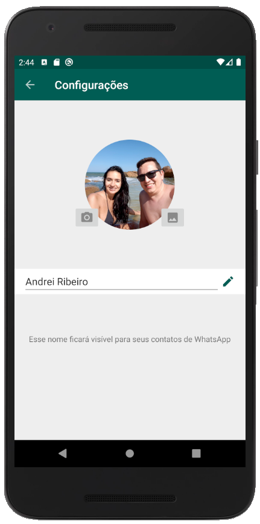
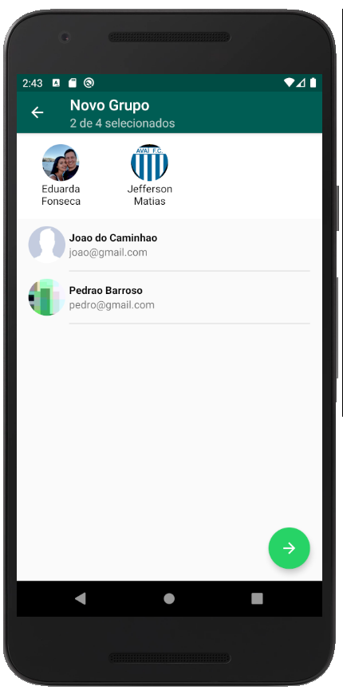

# Clone-whatsapp

Aplicativo clone para fins de conhecimento - 

Este projeto simula o aplicativo real, onde é possível você se cadastrar, enviar mensagens aos contatos, criar grupos de conversa, editar seu profile e enviar imagens de sua câmera ou galeria.

O aplicativo esta integrado com o Firebase, e utiliza os módulos Authentication, Realtime Database e Storage.

1. Tela de login.

2. Tela de cadastro.

3. Tela de configurações.

4. Tela de contatos/conversas

5. Tela de cadastro de grupos

7. Organização dados no Firebase

8. Autenticação via Firebase

